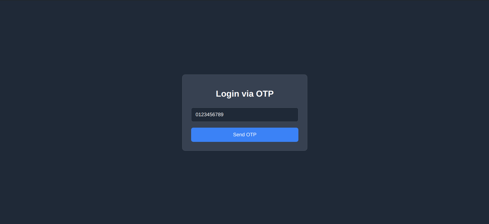
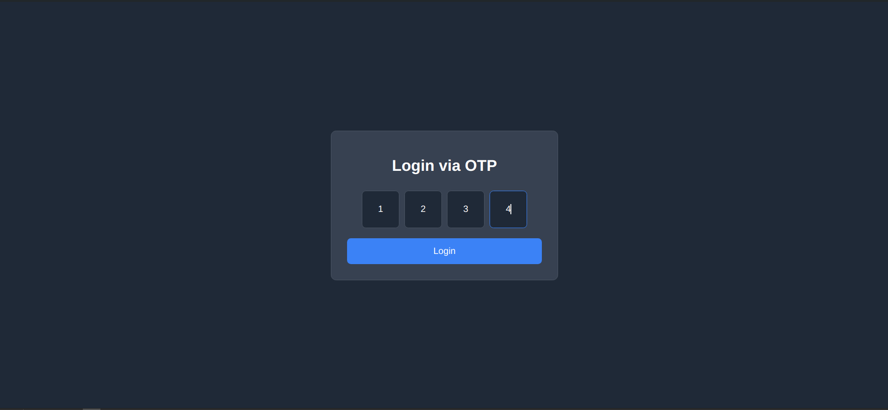

# OTP Login Design

This project implements a simple OTP (One Time Password) login flow using React, showcasing a minimalistic design and functionality. It leverages Vite for an efficient and fast development experience, along with React Router for navigation between the login and details pages.

## Features

- Minimal setup with React and Vite
- OTP login simulation
- Navigation between login and details page using React Router
- Responsive design for various devices

## Getting Started

These instructions will get you a copy of the project up and running on your local machine for development and testing purposes.

### Prerequisites

Before you begin, ensure you have the latest version of [Node.js](https://nodejs.org/) installed on your machine. This project was built using Node.js version 14.x.

### Installation

1. Clone the repository:

```bash
git clone https://github.com/nimeshthakur0/otp-login-design.git
```

2. Navigate to the project directory:

```bash
cd otp-login-design
```

3. Install the dependencies:

```bash
npm install
```

### Running the Development Server

To start the development server, run:

```bash
npm run dev
```

This will launch the Vite development server, and you should be able to view the application by navigating to `http://localhost:5173/` in your browser.

### Building for Production

To build the application for production, run:

```bash
npm run build
```

This will generate a `dist` folder containing the production-ready files.

## Usage

The application consists of two main pages:

- **Details Page**: Allows the user to enter their phone number.
- **Login Page**: Simulates an OTP login mechanism.

Navigate through the application to explore its features.

## Screenshots

Add your screenshots here:

- 

- 

## Contributing

Contributions are welcome! Please feel free to submit a pull request.

## License

This project is licensed under the MIT License - see the [LICENSE.md](LICENSE.md) file for details.
